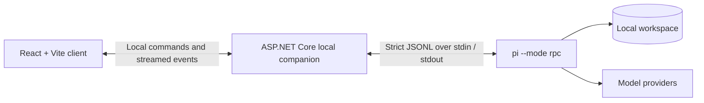

# Papliba

[](https://github.com/sunnybharne/papliba/actions/workflows/ci.yml)
[](https://github.com/sunnybharne/papliba/actions/workflows/pages.yml)
[](CHANGELOG.md)
[](LICENSE)

This Apache-2.0 repository contains the public website and documentation for Papliba, a local-first
agent operations workspace. The working application is maintained separately in private alpha.

> [!IMPORTANT]
> Version `0.8.0-alpha.1` is the public website release. A working private alpha validates the
> local companion and Pi RPC boundary. The application is not included here, publicly
> downloadable, or production-ready.

## Explore

- [Product site](https://sunnybharne.github.io/papliba/)
- [Product brief](docs/PRODUCT.md)
- [Architecture](docs/ARCHITECTURE.md)
- [Brand system](docs/BRAND.md)
- [Roadmap](docs/ROADMAP.md)
- [Contributing](CONTRIBUTING.md)

## Validated product boundary



The working alpha validates a React client, local companion, and Pi RPC boundary. Browser transport
remains an application implementation detail; JSONL over standard input/output is Pi's documented
RPC boundary. The private source is not part of this repository.

See [the full architecture decision](docs/ARCHITECTURE.md) for trust boundaries, message flow, alternatives, and open questions.

## Local development

Requirements:

- Node.js 24 LTS (`.nvmrc` pins the tested release)
- npm 11 or newer

```bash
git clone https://github.com/sunnybharne/papliba.git
cd papliba
nvm use
npm ci
npm run dev
```

The GitHub Pages site uses hash routes and Vite's `/papliba/` base path, so no server-side route fallback is required.

## Quality checks

```bash
npm run validate
```

The validation pipeline checks formatting, ESLint, TypeScript, Vitest, and the production build. Husky runs staged-file checks before commits and Commitlint enforces [Conventional Commits](https://www.conventionalcommits.org/).

## Project history

The public site was rebooted after an earlier prototype, which remains recoverable on the
[`archive/v0.7.0`](https://github.com/sunnybharne/papliba/tree/archive/v0.7.0) branch. A separate
private alpha now carries the product forward from that architecture foundation.

## License

This public website and documentation repository is licensed under the
[Apache License 2.0](LICENSE). That license does not apply to the separate private application.
