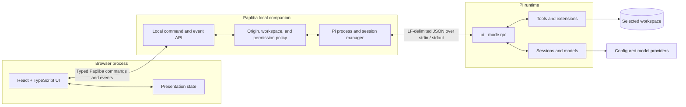
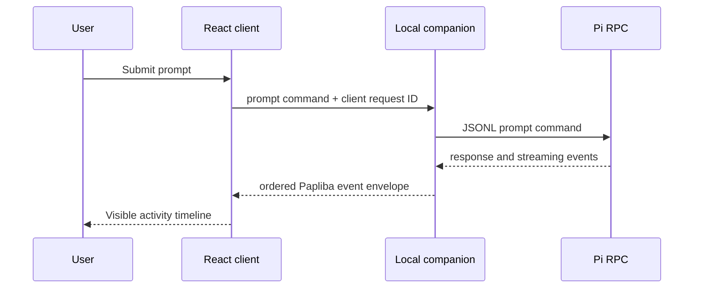

# Validated alpha architecture

Status: **validated in private alpha**

Decision record: [ADR-001](decisions/001-runtime-boundary.md)

Scope: public reference for the private alpha boundary

## Context

This public repository builds only the React product and documentation site. The working
application is maintained separately and uses a trusted local boundary because a browser page
cannot safely launch Pi or access a workspace. The private alpha validates the React client →
local companion → Pi RPC separation.

## System view



## Responsibility boundaries

### React client

Owns:

- page layout, navigation, and browser state;
- session timeline and streaming presentation;
- tool, error, and file-change views;
- explicit user actions and approval surfaces;
- reconnect and process-state presentation.

Does not own:

- local credentials or arbitrary filesystem access;
- launching processes or shell commands;
- Pi session semantics;
- model-provider integrations.

### ASP.NET Core local companion

Owns:

- binding to loopback and validating the browser origin;
- starting, monitoring, and stopping the Pi child process;
- keeping Pi stdout dedicated to protocol JSONL and stderr dedicated to diagnostics;
- correlating RPC requests, responses, and streaming events;
- validating workspace selection and normalizing paths;
- translating between the browser transport and Pi RPC without inventing agent behavior;
- health, version, and compatibility information.

Browser transport is an application implementation detail. The public architectural commitment is
the trusted local companion boundary; Pi RPC remains the runtime contract.

### Pi RPC process

Owns:

- the agent loop and state;
- prompts, abort, steering, and follow-up behavior;
- sessions, forks, compaction, and model selection;
- tool execution and extension UI requests;
- streaming agent and tool events.

Pi's documented RPC contract uses one JSON object per line over standard input and standard output. Papliba must never write diagnostics to the child's stdout stream.

## Example message flow



The Papliba envelope should add transport metadata—connection ID, sequence number, timestamp, and protocol version—without mutating the original Pi payload.

## Security posture

Before public distribution, the local companion must satisfy these requirements:

- listen on loopback only;
- reject unexpected `Origin` headers;
- use an ephemeral authentication token for the browser session;
- never accept a workspace path without canonicalization and explicit user selection;
- treat all browser input as untrusted;
- avoid storing provider credentials when Pi already owns them;
- expose process errors rather than retrying an unsafe action silently;
- apply resource limits and maximum message sizes;
- redact secrets from application logs.

GitHub Pages remains appropriate for the public product and documentation site. The application
itself is private and is not distributed from this repository.

## Versioning the boundary

Before public distribution, Papliba should version its browser-to-companion protocol separately.
An illustrative handshake is:

```json
{
  "paplibaVersion": "0.9.0-alpha.1",
  "protocolVersion": 1,
  "piVersion": "detected-at-runtime",
  "capabilities": ["prompt", "abort", "session-state"]
}
```

Capabilities allow the client to disable unsupported controls rather than guessing from version strings.

## Alternatives considered

### Next.js

Rejected for the current site. Static React and Vite are sufficient, produce a smaller conceptual surface, and deploy directly to GitHub Pages. A server-rendering framework would not solve the local-process boundary.

### Browser directly to Pi

Rejected. A regular browser cannot launch and supervise a local CLI process or safely own workspace authority.

### Rebuild on `pi-agent-core`

Rejected for the initial product. The lower-level package supplies the agent loop, but Papliba would then need to assemble Pi's tools, sessions, configuration, credentials, extensions, and workspace behavior itself.

### Node companion using the Pi SDK

Viable and officially recommended for TypeScript applications. The working alpha retains ASP.NET
Core so the local security/process boundary stays explicit. Revisit that choice only if packaging
or maintenance costs block safe distribution.

### Experimental Pi client/server transport

Deferred. Pi's experimental browser client and server packages are evolving and do not currently provide a standalone coding-agent service. Papliba should begin with the stable RPC contract.

## Primary references

- [Pi RPC mode](https://pi.dev/docs/latest/rpc)
- [Pi SDK](https://pi.dev/docs/latest/sdk)
- [Pi agent core](https://github.com/earendil-works/pi/blob/main/packages/agent/README.md)
- [Experimental Pi client](https://github.com/earendil-works/pi/blob/main/packages/client/README.md)
- [Experimental Pi server](https://github.com/earendil-works/pi/blob/main/packages/server/README.md)

The browser transport and ASP.NET Core are Papliba design decisions; they are not Pi RPC
requirements.
